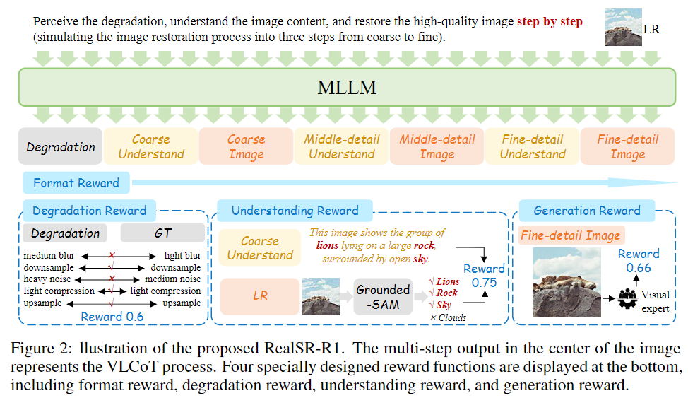
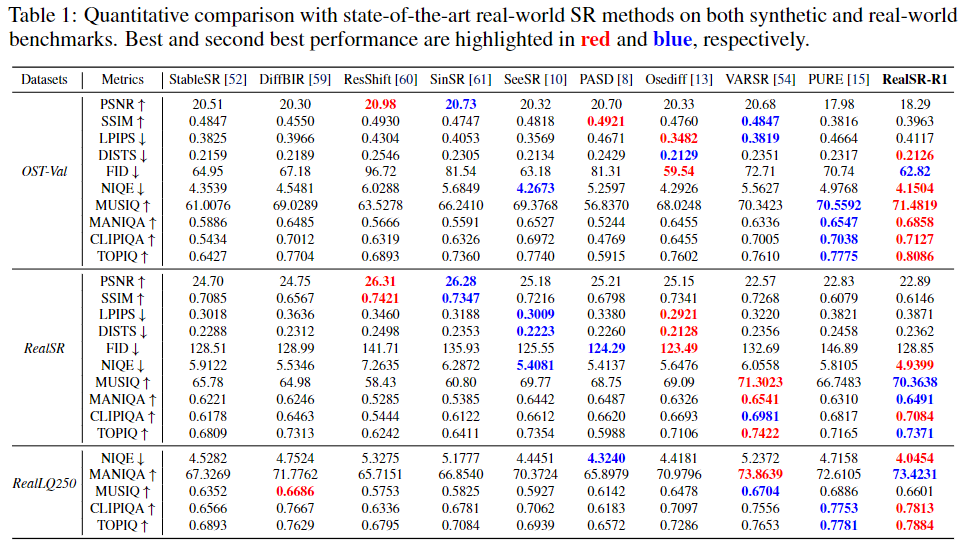
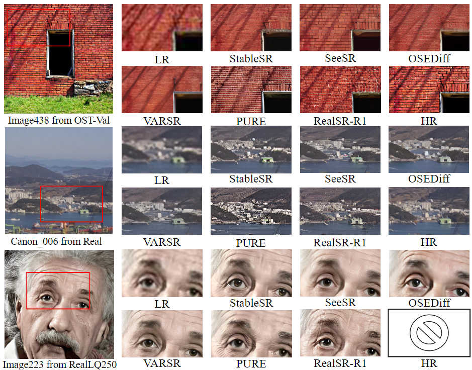

# RealSR-R1: Reinforcement Learning for Real-World Image Super-Resolution with Vision-Language Chain-of-Thought

    Junbo Qiao1,†&emsp;
    Miaomiao Cai2†&emsp;
    Wei Li3*&emsp;
    Yutong Liu1,2&emsp;
    Xudong Huang3&emsp;
    Gaoqi He1&emsp;
    Jiao Xie1&emsp;
    Jie Hu3&emsp;
    Shaohui Lin1*&emsp;

    1East China Normal University, 2University of Science and Technology of China, 3Huawei Noah’s Ark Lab,  

---

> **Abstract:** 
Real-World Image Super-Resolution is one of the most challenging task in image restoration. However, existing methods struggle with an accurate understanding of degraded image content, leading to reconstructed results that are both low-fidelity and unnatural. We present RealSR-R1, which empowers the RealSR models with understanding and reasoning capabilities. Inspired by the success of Chain of Thought (CoT) in large language models (LLMs), we simulate the human process of handling degraded images and propose the VLCoT framework, which integrates vision and language reasoning. The framework aims to precisely restore image details by progressively generating more comprehensive text and higher-resolution images. To overcome the challenge of traditional supervised learning CoT failing to generalize to real-world scenarios, we introduce, for the first time, Group Relative Policy Optimization (GRPO) into the Real-World Image Super-Resolution task. We propose VLCoT-GRPO as a solution, which designs four reward functions: (1) Format reward, used to standardize the CoT process; (2) Degradation reward, to incentivize accurate degradation estimation; (3) Understanding reward, to ensure the accuracy of the generated content; and (4) Generation reward, where we propose using a visual expert model to evaluate the quality of generated images, encouraging the model to generate more realistic images. Extensive experiments demonstrate that our proposed RealSR-R1 can generate realistic details and accurately understand image content, particularly in semantically rich scenes or images with severe degradation.

## ⚒️ TODO

* [ ] Release code and pretrained models
-

## Results

Quantitative Comparisons (click to expand)

  

Visual Comparisons (click to expand)

  

